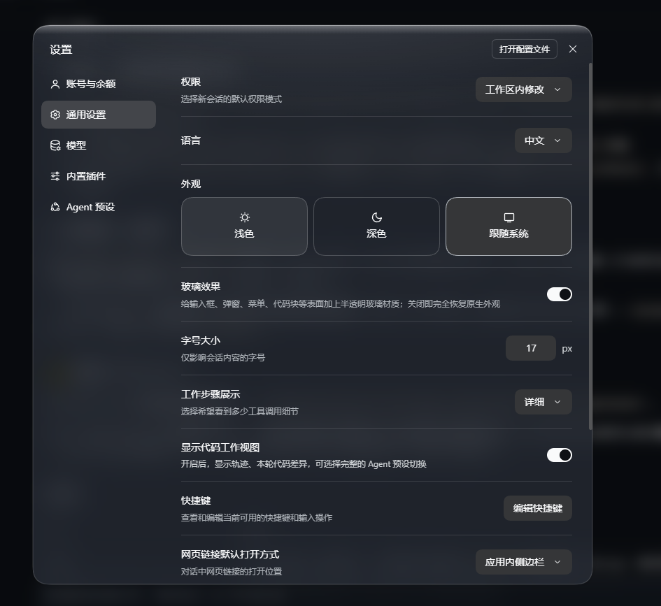

# 玻璃效果（dsh-glass-effect）

[English](README.md) | **简体中文**

为 DSH 界面提供统一的半透明玻璃材质：输入框、弹窗、菜单、卡片与代码块共用同一套材质，浅色与深色各自取值。

## 功能

- 输入框、弹窗、菜单、代码块、任务面板与右侧栏面板统一为半透明材质；
- 顶部高光、边缘反光与背景模糊，按浅色 / 深色分别设定；
- 设置内提供总开关，关闭后完全还原原生外观——插件写入的属性不会残留。

## 安装

DSH 自带图形安装器，全程无需命令行。

### 方式一 · 从 GitHub 安装（推荐）

1. 打开 **设置 → 插件 → 添加插件**；
2. 在「包名或地址」中填入：
   `https://github.com/Yinhefuluoye/dsh-glass-effect`
3. 点「安装」，完成后**重启 DSH**。

### 方式二 · 从 Release 安装（不依赖 git）

1. 在 [Releases](../../releases) 下载 `dsh-glass-effect-0.2.0.tgz`，或直接复制它的下载地址；
2. 打开 **设置 → 插件 → 添加插件**，把该地址填入同一栏；
3. 点「安装」，完成后**重启 DSH**。

> GitHub 地址与 `.tgz` 直链不经过安装源，需要本机能直接访问（或已配置代理）。

### 方式三 · 从源码安装（开发者）

把仓库 clone 到本地，用该 profile 的 pnpm 以本地目录路径安装（`file:`）。客户端部分在下次启动 DSH 时加载；改过源码后需 `remove` + `add` 重新安装，profile 内的副本才会更新。

> 桌面端未绑定刷新快捷键（`Ctrl+R` 无效），请重启应用。

## 使用

**设置 → 通用 → 外观**，三个配色选项的下方即为此插件的开关：

| 状态 | 效果 |
| --- | --- |
| 开 | 应用玻璃外观 |
| 关 | 与原生外观完全一致 |

无快捷键，无其他入口。

## 卸载

从 profile 的 `dsh.profile.bundles` 中移除 `"dsh-glass-effect"`，执行 `pnpm remove dsh-glass-effect` 后重启。仅需临时还原时，使用上述开关。

## 兼容性

- 桌面端（Electron）与网页端（`dsh web`）通用，二者使用同一套 Web 客户端；
- 开关状态按站点（origin）分别存储，互不影响；
- 依赖 DSH 0.2.x（使用 `settings.general.item` 槽位与 `ui-primitives` 的 `Switch`）。

## 行为边界

- **不联网**：无 fetch / XHR / WebSocket 请求；
- **不采集**：不读取 cookie、会话数据或任何凭据；
- **不修改应用源码**：仅注入一张样式表、在 `body` 上标记属性、通过主题服务覆盖一层 token，并在设置中注册一行；卸载时全部还原；
- 仅写入插件自身的 localStorage 键；
- 不注册全局快捷键。

`lib/client.js` 为单文件、无构建步骤，可直接审阅；`tools/verify.mjs` 提供离线自检（43 项断言，其中包含"不得联网、不得读取会话数据"的静态检查）。

## 许可

MIT。玻璃手法参考 [394804078-pixel/dsh-liquid-glass](https://github.com/394804078-pixel/dsh-liquid-glass)（同样 MIT），署名见 [LICENSE](LICENSE)。
